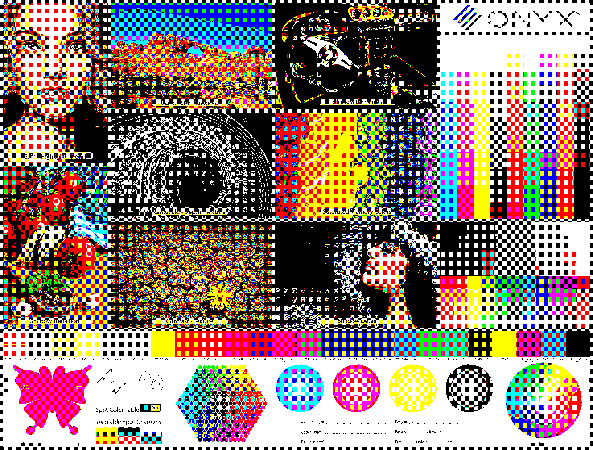

# Rembot
2D Plotting device. This project was developed on a RaspberryPi 3

# Hardware
* Raspberry Pi
* Picamera module
* Arduino Uno
* Motor driver boards
* Stepper Motors
* 3D Printer Parts

# Setup
```bash
    # clone repository
    git clone https://github.com/technovus-sfu/rembot.git

    # install python dependencies
    pip install <library>

    # navigate to software folder
    cd rembot/software

    # run program
    python -m main
```
 

# Contact
* [Technovus  Admin](mailto:technovus.sfu@gmail.com)
